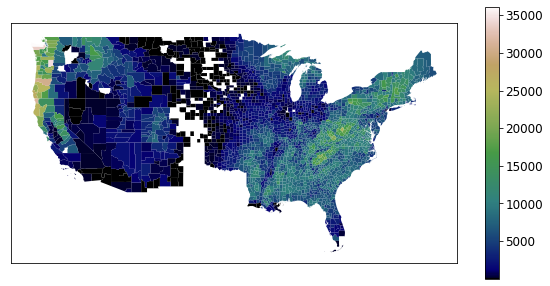
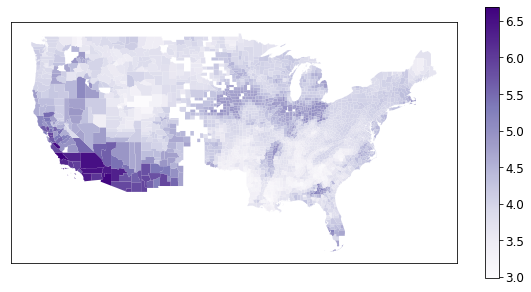
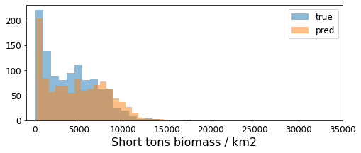

# forest-biomass-modeling: Predicting forest carbon stocks in the contiguous U.S.
## About
In this project I explore the viability of statistical models to predict forest biomass. These models are trained on an existing dataset of forest biomass measurements collected by the USDA Forest Service and utilize features generated from remote sensing data collected by the NASA MODIS sensor. 

I find that several aggregate remote sensing features are predictive of county-panel-level forest biomass estimates, achieving an R2 of `0.60`. Specifically, more variable land surface temperature and NDVI are associated with lower forest biomass, and a higher minimum land surface temperature is associated with lower forest biomass. 

My aim with these statitical models is to support predictions under three scenarios: in regions with existing measurements, in regions without existing measurements, and forward in time. I find that the Random Forest Regressor yields the lowest RMSE in cross validation across all three of these scenarios. For the first scenario only, I find that the test data and test predictions are not statistically distinct, which offers further support for this model’s use in making broad scale forest biomass predictions.

## Using this repo
While this repo was built for academic research and not production code, many of the functions in the [notebooks](notebooks/) folder may be useful for downloading US Forest Service and NASA datasets ([modis_cleaning.py](notebooks/modis_cleaning.py)), processing NASA MODIS data ([data_processing.py](notebooks/data_processing.py)), and SciKit-Learn model training ([train_functions.py](notebooks/train_functions.py)).

## Dataset
In this research, I compile a dataset of county-level biomass estimates from the USDA Forest Service and spatio-temporal aggregated satellite imagery data from NASA’s Moderate Resolution Imaging Spectoradiometer (MODIS).

### USDA Forest Service data
Since the late 1930s, the USDA Forest Service has surveyed US forests at the county level through the Forest Inventory and Analysis program (USDA FS FIA). The FIA surveys a forest over 5-7 year periods through a random sampling procedure, and provides panel-county-level forest biomass estimates to the public through an online portal called The Design and Analysis Toolkit for Inventory and Monitoring (DATIM). In this analysis I use the FIA’s estimate of aboveground forest biomass measured in short tons of carbon.

#### USDA FS aboveground forest biomass (Short tons/km2), in most recent USDA FS panel

### NASA MODIS data
The NASA MODIS satellite-based sensor is on board two satellites tracking land and ocean surface climate measurements, launched in the late 1990s and early 2000s respectively. For broader scale use, NASA provides Level 3 gridded data products built from lower-level products relying on the raw sensor readings. In this analysis, I use monthly binned L3 readings at a 5600m grid scale, accessed through NASA’s EarthDataSearch platform. In this analysis I consider mean monthly land surface daytime temperature (LST) and mean monthly normalized difference vegetation index (NDVI). NDVI is roughly a measure of how green the land looks from space.

I create a uniform analysis dataset for this research by aggregating NASA MODIS data across space and time. I begin by aggregating MODIS data at the annual level, storing the mean, standard deviation, maximum, and minimum at each pixel. For each property in each pixel-year, I also generate two new metrics: the number of months below the annual mean, and the maximum number of consecutive months below the annual mean. These metrics are meant to help differentiate forests or regions with different dominant trees (e.g. deciduous trees vs. evergreen trees). To relate these estimates to the county-panel level, I then take the mean and standard deviation of all annual-aggregated pixel values in each county. And finally, to map these county-aggregated values to county-panel aggregated values, I take the mean of each property over the panel period (5-7 years, depending on the state). Lastly, I standardize all features for use in statistical models.

#### NASA MODIS Land Surface Temperature: Mean across county and most recent USDA FS panel (◦C)

#### NASA MODIS NDVI: Mean across county and most recent USDA FS panel (◦C)

#### NASA MODIS Land Surface Temperature: Consecutive months below average NDVI per year across county and most recent USDA FS panel (◦C)

## Results: Parameter selection
I use LASSO regularization paths to first visualize, then identify the importance of features in my feature space. LASSO regularization paths plot the magnitude of coefficients in a LASSO regression with varying values of the regularization tuning parameter. 

Here I observe several key variables emerge with high coefficients under a high regularization constant (left-most side of the graph), and their coefficients continue to increase as the regularization constant decreases (moving right along the graph). The six variables that emerge strongest are the LST consecutive months below the mean, NDVI mean annual standard deviation, LST mean annual standard deviation, LST mean annual minimum, NDVI standard deviation of the annual mean, and NDVI standard deviation of the annual maximum.

#### Lasso path parameter selection

## Results: Model selection
I aim to develop models to predict forest biomass for three distinct use cases: predicting in regions with existing measurements, predicting in regions without existing measurements, and predicting forward in time. I describe how I optimize models for each of these distinct tasks below.
1. First, to optimize a model for predicting forest biomass in regions with existing measurements, I develop a K-fold county cross validation approach. I begin by holding out 10% of counties for final model evaluation. With the remaining data, I implement a grouped five-fold cross validation strategy. This grouped k-fold ensures that all panels for each county only appear in a single fold, thus ensuring that each county-panel prediction is made with a model that has not yet seen any data from that county. 
2. Next, to optimize a model for predicting forest biomass in regions without existing measurements, I develop a state leave-one-out approach. I begin by holding out 5 states at random (chosen with weight proportional to number of counties in the state) for final model evaluation. With the remaining data, I hold out a single state at a time, train the model on the remaining states, and predict forest biomass in each county within the held-out state. 
3. Finally, to optimize a model for predicting forest biomass in future time panels, I first hold out the last panel from each county for final model evaluation. With the remaining data, I perform cross validation where I leave out one of the panels of data in each fold. For reference, each state has between one and four panels of data, so this results in 3 distinct folds.

My data splitting scenarios resulted in a test dataset of `10%` at random for county k-fold regime, a test dataset of `12.9%` (including all of AL, MN, OH, and WI) for my state leave-one-out regime, and a test dataset of `32%` for my future prediction regime.
In all three of my splitting regimes, I find that my selected models perform well. In each case, RMSE is not significantly higher than it was in my cross validaiton exercise, giving me confidence that these models are likely not overfit. RMSE on the test dataset was `1136`, `1547`, and `1596` short tons / km2 respectively; R2 was `0.92`, `0.74`, and `0.89` respectively; and MAE was `822`, `1109`, and `1068` short tons / km2 respectively.

### Performance on test data
#### Performance on test data for county K-fold

#### Performance on test data for state LOO

#### Performance on test data for future prediction

### Histograms of predictions
#### Histogram of forest biomass predictions for county K-fold

#### Histogram of forest biomass predictions for state LOO

#### Histogram of forest biomass predictions for future prediction

